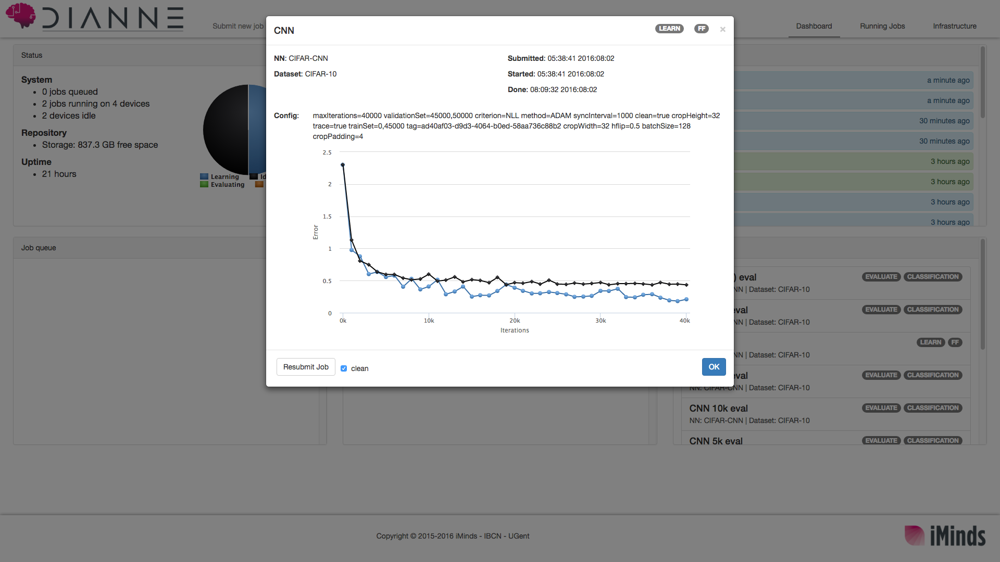
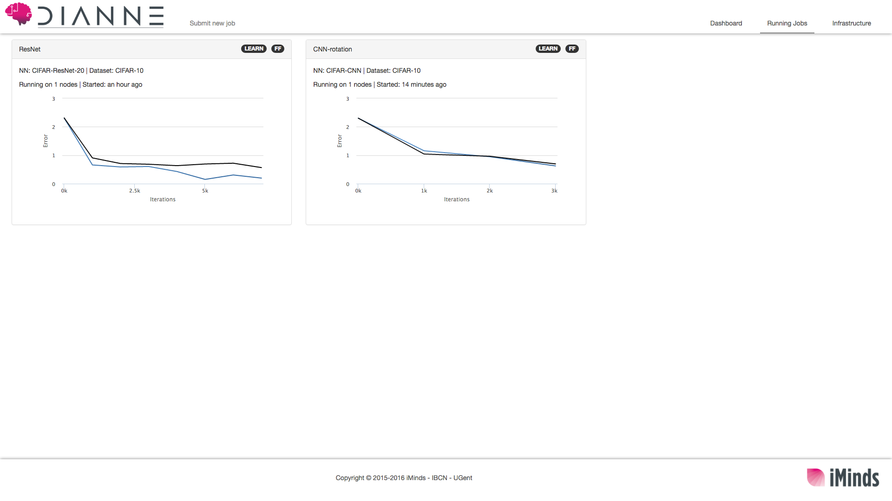
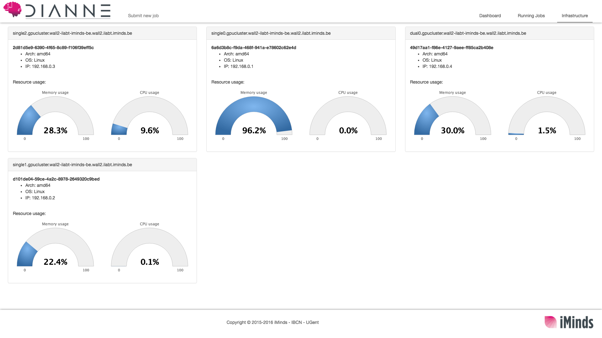

Dashboard: scale up your training
=================================

While the Builder interface is great for designing your models and performing a quick test run, it can quickly become hard to keep track of everything that is going on when you are training multiple models simultaneously, especially on a distributed setup. Meet the Dashboard: a UI that allows you to submit and keep track of (learn) jobs and monitor your DIANNE cluster.

In order to setup a DIANNE cluster, you need at least a `DianneCoordinator` service and one or more connected DIANNE runtimes which have a `Learner`, `Evaluator` and/or `Agent` service. A number of common configurations are available in the `tools` directory and on the DIANNE [downloads page](http://dianne.intec.ugent.be/downloads/).

Once you have setup the cluster, you can access the Dashboard by pointing your browser to:

	http://<hostname_of_coordinator>:8080/dianne/ui/dashboard/dashboard.html

You should be greeted by the summary dashboard. On this page you get an overview of the infrastructure, queued, running and finished jobs as well a list of notifications, e.g. when jobs have started or finished:

On the top left you can see the "Submit job" button. When you click on it, a pop-up window appears were you can configure the job:

In order to submit a job you need to enter the following details:

* **Name**: A name for easy reference. Internally, each job has gets its own UUID, so you can reuse names if you want to. This UUID is also used as the *tag* option in case you do not specify one explicitly. Tags are used to distinguish multiple sets of weights of the same model, allowing you to e.g. have simultaneous learning jobs with different hyperparameters.
* **Type**: The type of the job; currently there are three kinds:
  * *LEARN*: Used for training models. This requires at least one idle `Learner` service to be available in the cluster.
  * *EVALUATE*: Used for evaluating trained models. This requires at least one idle `Evaluator` service.
  * *ACT*: Used for reinforcement learning. This requires an idle `Agent` service to interact with an environment to generate experience. **Note**: reinforcement learning in DIANNE is still in major development, have a look at the `master` branch for the latest features.
* **Neural Network**: The network that needs to be deployed for the job. You can select any available network from the `Repository` from the dropdown list. *Tip*: you can easily switch between the Builder & Dashboard by clicking the DIANNE logo!
* **Dataset**: The dataset that will be used for the job. Any `Dataset` service available on the cluster will be listed here. To add your own dataset, or use data augmentation using adapters, please see the [dataset documentation on GitHub](https://github.com/ibcn-cloudlet/dianne/blob/v0.4.0/doc/datasets.md).
* **Options**: Allows you to specify the options for the job in a `key=value` manner. Each type of job will have different options available. For a complete list of options and their default values, please see the [configuration documentation on GitHub](https://github.com/ibcn-cloudlet/dianne/blob/v0.4.0/doc/configuration.md).

Once you have set all the required details, just click the `Submit` button and your job will be submitted to the job queue. If the necessary requirements for the job are met (i.e. there is an idle `Learner` service for a learning job), the job will be started. When the job is finished, you can click on it to view the result:

Depending on the job, you get a different visualization of the job. For training jobs, for example, you get a plot with the error as a function of the number of iterations (updates). You can also see the time the job was submitted, started and finished as well as resubmit the job.

When you have multiple jobs running simultaneously, you can check their progress on the `Running jobs` tab. Here you get a grid which shows the progress for every running job.

Finally, on the `Infrastructure` tab, you get an overview of the system load on all your connected machines, showing real-time information such as CPU and memory usage:

