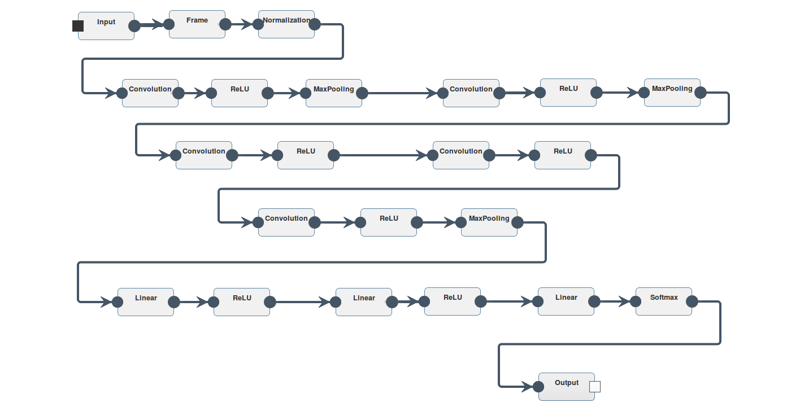

DIANNE overview
===============

Modules
-------

In DIANNE, the central entity is the **Module**. A Module is a basic building blocks of a neural network, which provides two flows of information: a forward pass and a backward pass. In the forward pass, required for neural network execution, the input data is transformed in some way to give an output. In the backward pass, required for training neural networks, the gradient on the output of the previous forward pass is taken in and the corresponding gradient on the input is calculated. Each module can have one (or more) next modules to forward its output to, and one (or more) previous modules to propagate the gradient on the input to.

A neural network can be constructed by chaining a number of modules. Starting with a special **Input** module, which simply forwards the input data, and ending with another special **Output** module, which collects the output. Besides the Input and the Output module, DIANNE supports a number of other types to build up neural networks. A **Linear** module calculates a weighted sum of the input and can be combined with an activation module (currently **Sigmoid**, **Tanh** and (Parameterized) Rectified Linear Units (**(P)ReLU**) modules are supported) to model a fully connected neural network layer. For classification, a **Softmax** module is added before the Output which converts the output to classification probabilities.  

Besides modules for fully connected neural networks, we provide **Convolution** and **MaxPooling** modules which are  frequently used in state-of-the-art convolutional neural networks. Various split and combine modules allow to create parallel paths in a neural network. These special split and combine modules are the only modules which can have multiple next and previous modules. Finally, a number of preprocessing modules are provided, for example to normalize the input samples. By combining these modules one can build popular neural networks, such as for example the [Overfeat neural network](http://cilvr.nyu.edu/doku.php?id=software:overfeat:start):

In DIANNE, the Module is not only a functional block, but also a unit of deployment. This means that each individual module can be deployed on any device in a distributed computing environment. This allows fine grained distribution of neural network modules, enabling offloading parts of a neural network in case of small and embedded devices, or model-parallellism when training large neural network models.

Runtime
-------

DIANNE runtime figure

Repository
----------

NN repository - JSON format - weights

Datasets
--------

How datasets are implemented

Platform
--------

API for accessing the platform
 
Training
--------

learn/eval api - coordinator/json rpc api - 

Reinforcement Learning
----------------------

environments , agents and experience pools 

  