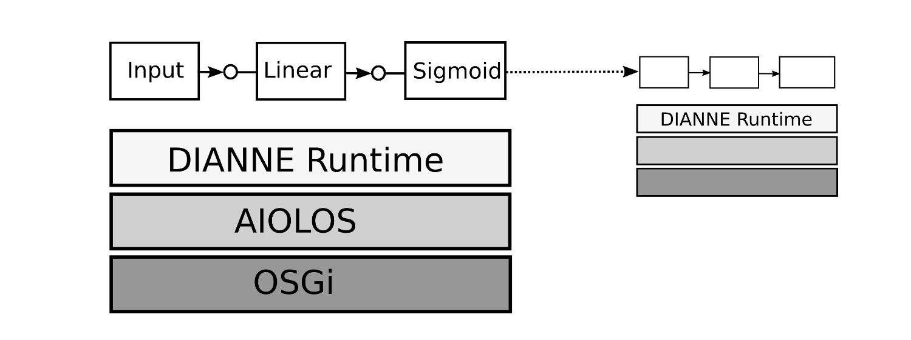
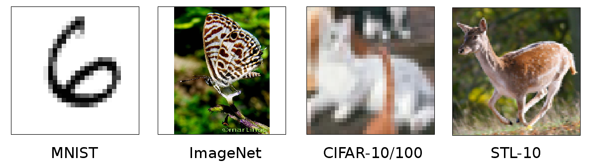

DIANNE overview
===============

Modules
-------

In DIANNE, the central entity is the **Module**. A Module is a basic building block of a neural network, which provides two flows of information: a forward pass and a backward pass. In the forward pass, required for model evaluation, the input data is transformed in some way to give an output. In the backward pass, required for model training, the gradient on the output resulting from the previous forward pass and an error criterion is taken in and the corresponding gradient on the input and weights is calculated. Each module can have one or more subsequent modules to forward its output to, and one or more preceding modules to propagate the gradient on the input to.

A neural network can be constructed by chaining a number of modules. Starting with an **Input** module, the entry point through which data will be pushed in the model, and ending with an **Output** module, which collects the output. Besides the Input and the Output module, DIANNE supports a number of other types to build up neural networks. For example, a **Linear** module calculates a weighted sum of the input and can be combined with an activation module (such as a **Sigmoid** or **ReLU**) to model a fully connected neural network layer. For classification, just add a **Softmax** module before the Output to convert the output to class probabilities.  

DIANNE provides a range of different modules to build up your models, such as **Convolution** and **MaxPooling** modules to design state-of-the-art convolutional neural networks. Various split and combine modules allow to create parallel paths in a neural network. These special split and combine modules can have multiple next and previous modules, effectively constructing a neural network as a directed graph of modules. Preprocessing modules are provided, for example to normalize the input samples. By combining these modules one can rebuild popular neural networks, such as for example the [Overfeat neural network](http://cilvr.nyu.edu/doku.php?id=software:overfeat:start):

In DIANNE, the Module is not only a functional block, but also a unit of deployment, meaning that each individual module can be deployed on any device in a distributed computing environment. This allows fine grained distribution of neural network modules, enabling offloading parts of a neural network in case of small and embedded devices, or model parallellism when training large neural network models. For a list of all the available modules in DIANNE, have a look at the [module catalog on GitHub](https://github.com/ibcn-cloudlet/dianne/blob/v0.5.0/doc/modules.md).

Tensors
-------

While DIANNE may be based on Java, this is by no means a hit on performance! All data arrays, such as parameters and return values of the module's forward and backward passes, are abstracted as **Tensor** objects. DIANNE provides its own Tensor API providing various operations on n-dimensional arrays. By keeping the underlying data and operations in native vs. JVM space, we can not only use powerful algebraic libraries, but also perform these operations on GPU. We are currently using native implementations based on the [torch and curtorch Tensor libraries](https://github.com/torch).

Runtime
-------

The DIANNE **Runtime** runs on top of AIOLOS and OSGi in order to provide runtime modularity and distributed deployment. On each device running the DIANNE stack any neural network module can be deployed. At runtime, all subsequent and preceding modules of the neural network are wired together and a processing graph is constructed. When two modules are deployed on different devices, they will communicate via the remote procedure call mechanism offered by AIOLOS.

Repository
----------

The DIANNE **Repository** service maintains a collection of configured neural networks, as well as a collection of trained weights for these neural networks. The neural network structure is stored in a file in JSON format, containing a map of all modules with their configuration parameters, as well as their connectivity to other modules. Trained weights of a module are saved in a binary format. Weights can be tagged, allowing the user to maintain different sets of weights, for example when training with different hyperparameters.

During training, the DIANNE repository acts as a parameter server. At the start of the training procedure, newly randomized weights will be stored into the repository. As training advances, updates to those weights are pushed to the repository, which will merge them. This way, the DIANNE repository can also be used for asynchronous gradient descent, when running multiple training routines in parallel.

Datasets
--------

In order to train and evaluate your neural network, DIANNE provides a **Dataset** interface that offers input samples and optionally corresponding outputs for either supervised or unsupervised learning. Similar to the model repository, datasets are added using JSON descriptor files. DIANNE has built-in adapters for various well-known image datasets, such as MNIST, ImageNet, CIFAR-10/100 and STL-10, for which you can download the configuration files on the [datasets page](http://dianne.intec.ugent.be/datasets/). You can also add your own dataset by simply creating a new descriptor file, see how in the [dataset documentation on GitHub](https://github.com/ibcn-cloudlet/dianne/blob/v0.5.0/doc/datasets.md).

Learners & Evaluators
---------------------

In order to train your models, DIANNE provides **Learner** services. These execute the training routines that will pull data from a dataset, feed it into the network, calculate the gradients and push weight updates to the repository. The training routines themselves are specified in **LearningStrategy** objects that only need to calculate weight updates, while more general tasks such as synchronizing with the repository are handled by the Learner itself. **LearningStrategy** implementations are available out-of-the-box for general feed-forward networks, but also generative models such as VAEs and GANs. Various well-known optimization and regularization techniques are also readily available, ranging from vanilla Stochastic Gradient Descent to Adam. 

The **Evaluator** service allows you to assess the performance of your model, not only in terms of average loss or classification accuracy, but also in terms of system performance, e.g. required computation time. This is useful for scenarios where you want to deploy your model on devices with limited compute power. Similar to the Learner service, the Evaluator takes an **EvaluationStrategy** object that specifies exactly how a model should be evaluated.

Coordinator
-----------

Once you start to scale up your training, either to train multiple models at the same time, or to train models that are too large for a single machine, you can use the DIANNE **Coordinator** service to keep things manageable. After connecting multiple DIANNE runtimes to one another, the coordinator allows you to manage learning and evaluation tasks using a job-scheduling system. Once you specify your job as a number of `key=value` configuration options, the coordinator will go to work by checking if suitable Learner and Evaluator services are available, configuring those services, deploying the required modules, starting the training procedure and monitoring the training progress. You can even submit custom Strategy implementations that automatically get compiled and distributed.

UI
--

The quickest way to get started with DIANNE is to use the two provided graphical user interfaces, which are available through the browser:

**Builder**: The Builder allows you to design, deploy, train and evaluate a (single) neural network model. During the build phase modules can be drag-and-dropped onto a canvas to create a neural network. Next, each module can be deployed individually to any connected DIANNE runtime. Once deployed, one can attach a Dataset to train and/or evaluate the neural network. In the run tab, one can connect actual sensor devices (i.e. a camera) to the neural network Input module and visualize the output!

**Dashboard**: The Dashboard is the front-end for the Coordinator and allows you to submit jobs through the browser, see what jobs are queued, running or finished, have a look at the progress or results of a job, as well as monitor your infrastructure.

Besides the graphical user interfaces, DIANNE can also be controlled via a command line interface, JSON RPC, or programmatically via the various APIs.

Upcoming
--------

DIANNE is still very much a project in development, and we are constantly adding new features, ranging from new modules to even faster native backends. We are currently working hard on adding new learning paradigms, such as backpropagation-through-time for recurrent models and reinforcement learning. Have a look at our [GitHub page](https://github.com/ibcn-cloudlet/dianne) for the latest features!
