Getting started
===============

0.Prerequisites
---------------

In order to build and run DIANNE the following is required:

- [Git](http://git-scm.com/)

- Java JDK (minimal version **1.8**) i.e. [Oracle JDK](http://www.oracle.com/technetwork/java/javase/downloads/index.html) 
or [OpenJDK](http://openjdk.java.net/)

- [Apache Ant](http://ant.apache.org/) version 1.9 or higher 

**Note**: At the moment we only have native code builds for Linux and Mac, Windows is currently not supported. Windows users can run DIANNE but have to use the Java tensor implementations (i.e. replacing `be.iminds.iot.dianne.tensor.th` by `be.iminds.iot.dianne.tensor.java` in each .bndrun file). The web UI is tested with the latest Firefox and Chrome browsers. 

To develop and build OSGi bundles, the [BND](http://www.aqute.biz/Bnd/Bnd) tool is used. 
This is included in the git repository, so no additional download is required. Although
any code editor suffices to develop for DIANNE, we recommend the following setup:

- [Eclipse](http://www.eclipse.org/downloads/)

- [BNDTools](http://bndtools.org/) plugin for Eclipse
	The BNDTools plugin allows you to easily view and edit .bnd files used for configuring
	and building OSGi bundles. This plugin also allows you to create run configurations to
	easily test the framework on your local computer.

	BNDTools can be downloaded from the marketplace inside Eclipse. (Help > Eclipse Marketplace... > Search for BNDTools)

	A nice tutorial on how to develop OSGi applications using BNDTools is available from
	their [website](http://bndtools.org/tutorial.html).

1.Deploy your first neural network
----------------------------------

To build and run DIANNE, first clone the git repository.

		git clone git@github.com:ibcn-cloudlet/dianne.git

Next, simply use the ant `build` target to build

		cd dianne
		ant clean build
		
To run DIANNE, type

		ant mnist

This will launch AIOLOS with DIANNE, and also install the MNIST dataset and an example neural network.

Once the runtime is started, direct your browser to

		http://localhost:8080/dianne
		
The DIANNE web UI should show up:

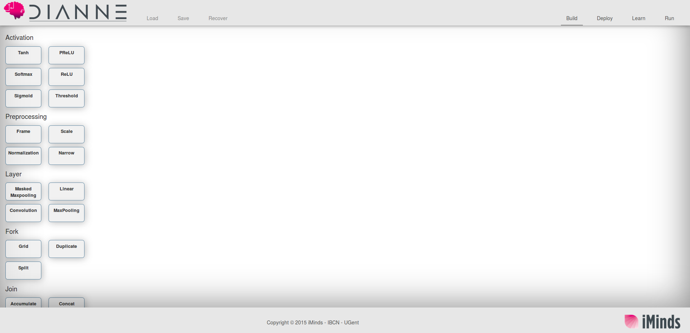

You can start building your own neural network by dragging and dropping components on the canvas. However, to start, we will load an example neural network by clicking the `Load` menu item. Choose the `mnist` neural network and hit the `Load` button in the dialog. Now a simple fully connected neural network with one hidden layer and sigmoid activation functions is shown.

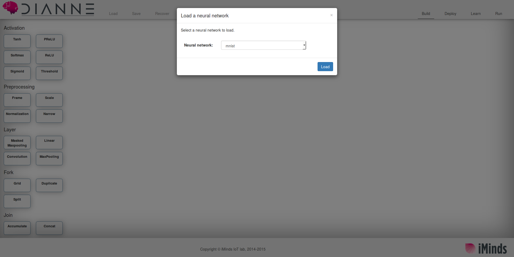

To deploy this neural network, go to the deploy mode by clicking the `Deploy` menu item top right. Now, instead of available neural network building blocks, you will see all available DIANNE runtimes.

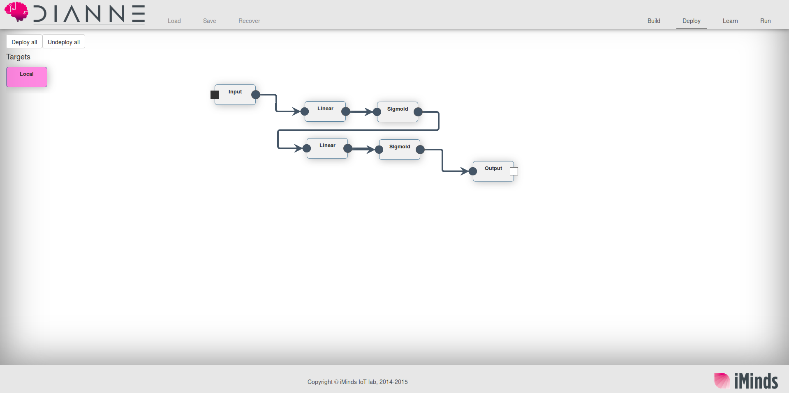

 Right now this is only one, your local environment. To deploy the neural network modules, click on the `Local` runtime box, and next click `Deploy All`. You can also click the `Local` runtime box, and then click on each of the modules separately. Congratulations, you have just deployed your first neural network on DIANNE.

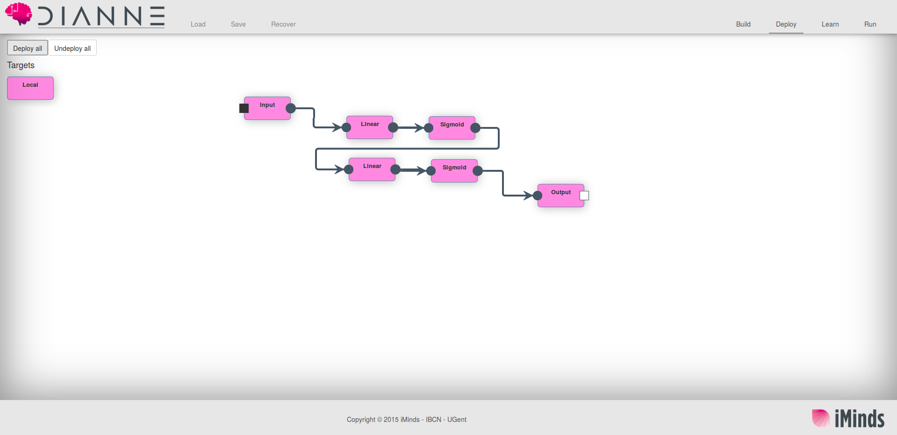

Now to see this neural network in action, click the `Run` menu item top right. You can skip the `Learn` tab for now since we already trained this neural network for you. In the `Run` tab, drag the `MNIST` dataset on the canvas and connect it to the `Input` module. Similarly select an `Output probabilities` block and connect the `Output` module to it:

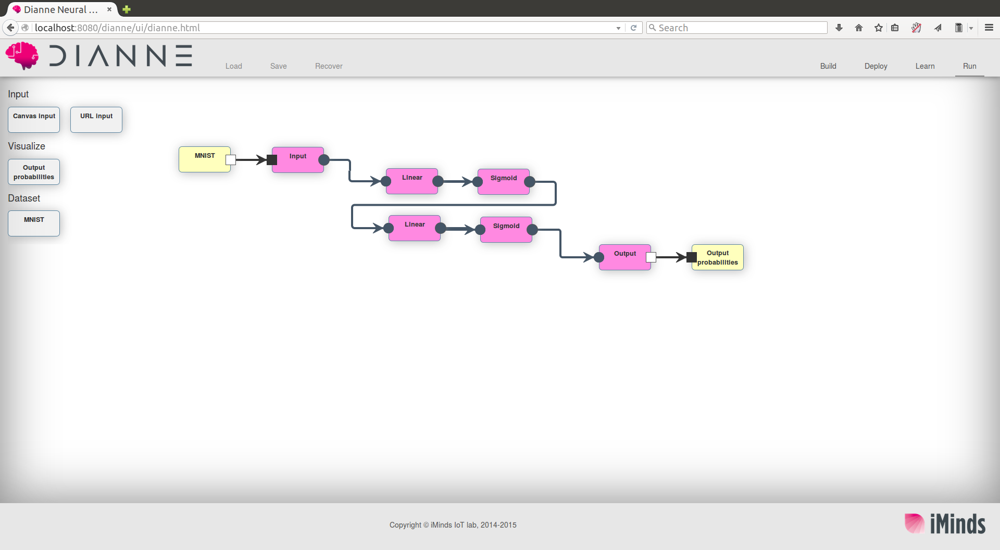

Now you are set to forward your first sample through the neural network. Double click on both the `MNIST` module and `Output probabilities` blocks you added to the canvas. Two dialogs will pop up. Click the `Sample` button to randomly select a sample of the dataset and forward it through the network. The output probabilities will be visualized in the other dialog.

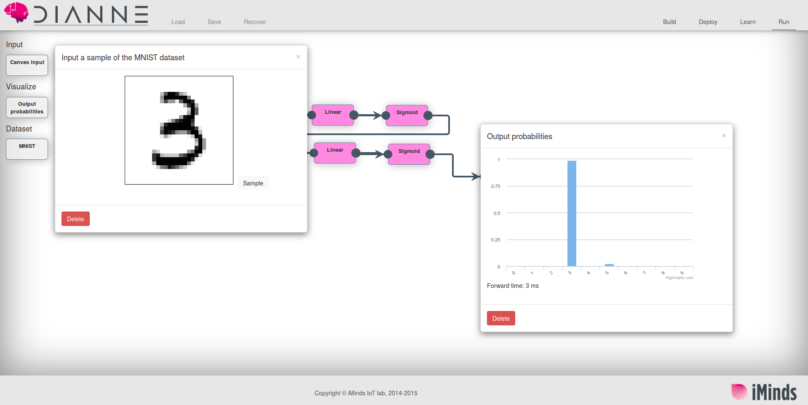

You can now go ahead and build and train your own neural network. To clear the canvas, just refresh the browser.

2.Build and train your own neural network
-----------------------------------------

To build your own neural network, drag and drop modules from the toolbox onto the canvas. You can scroll down the toolbox list, and you can (un)collapse categories by clicking on the category title.  Connect the modules together such that you start with an `Input` module and end with an `Output` module, for example:

Next, configure the modules by double clicking on them. Both the `Linear` modules need to be configured with an input and output size. Since we are working with the MNIST dataset, which is consists of 28x28 single channel images, the input of the first `Linear` is 28 x 28 = 784. The output is the number of hidden neurons we would like, for example 40.

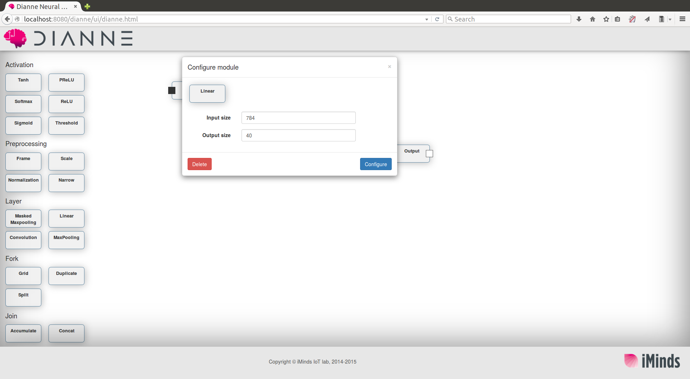

The second `Linear` module will then take 40 inputs, and the output will be the number of output classes, in the case of MNIST this is 10.

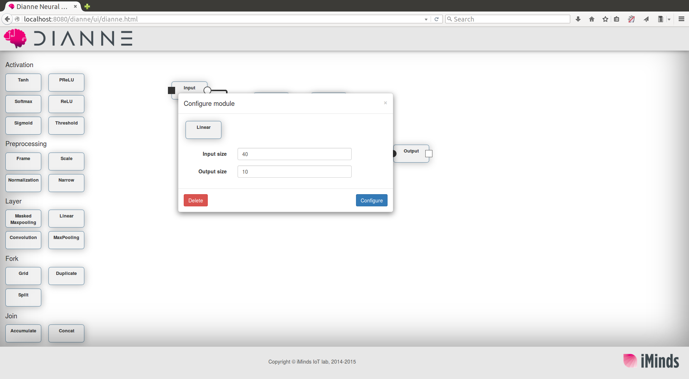

Now deploy this neural network. When hitting the `Deploy` menu item, you will first be asked to save this neural network. Just give it a name you like

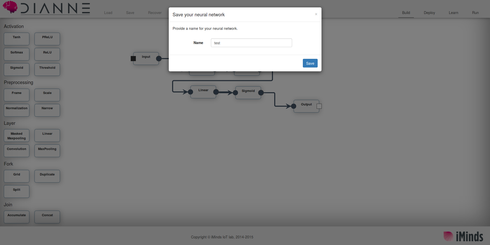

Now click the `Learn` menu item to train your neural network. Start by adding an `MNIST` dataset and connecting this to your `Input`. Double clicking the dataset allows you to select how many samples will be used for training and how many will be used for testing. 

To convince yourself that the neural network is actually not trained at all, connect an `Arg Max Evaluator`, double click on it and click `evaluate`. From the confusion matrix you can see that the neural network is not yet trained.

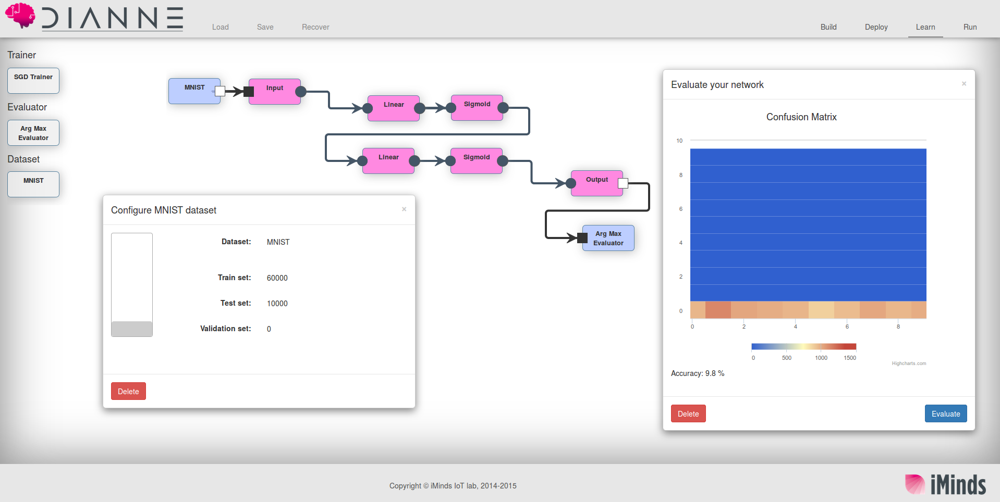

Now connect an `SGD Trainer` block to the `Output` and open the training dialog by double clicking on it. The default parameters should suffice for this example, so click `Train`. Now the training procedure should start and you should see how the error decreases as training proceeds. 

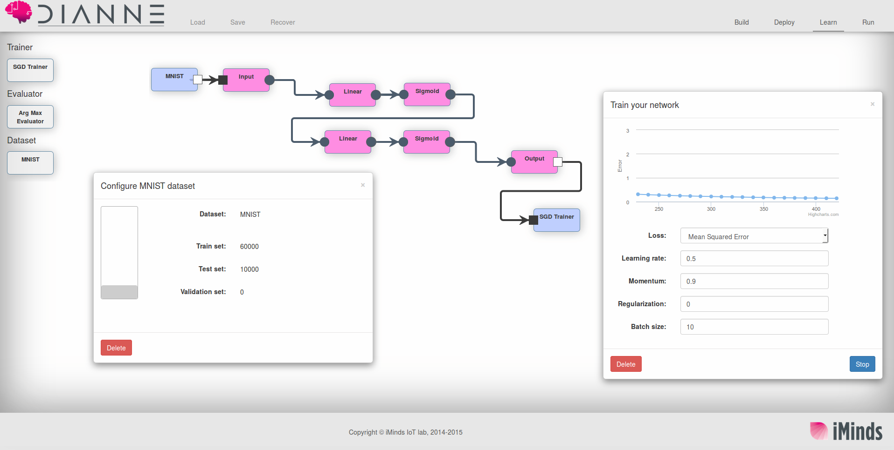

Click `Stop` when you are satisfied with the training. After a few minutes of training, your network should be able to reach over 90 per cent accuracy. Run the `Arg Max Evaluator` again. The confusion matrix should now highlight the diagonal meaning that the neural network performs good.

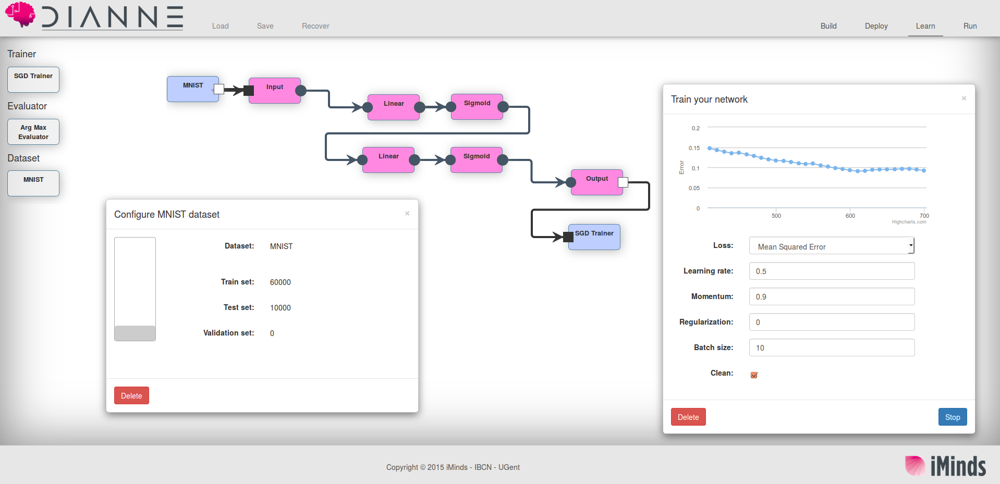

To convince yourself even further, you can go ahead to the `Run` tab and see the outputs for individual samples.

3.Using the DIANNE APIs
-----------------------

Since DIANNE is built on top of OSGi/AIOLOS, all services that are used internally are also available for 3rd party applications. The most interesting OSGi services are the following:

- `DiannePlatform` : offers an API to deploy neural networks from the repository, or deploy individual neural network modules

- `Dianne`: allows you to get a `NeuralNetwork` reference to a neural network instance deployed via `DiannePlatform`. This offers a clean API to interact with a neural network instance, providing methods to perform a forward or backward pass, get or set the parameters, query all modules, etc.

- `DianneCoordinator`: is a more high level interface that allows you to submit learn and evaluation tasks to DIANNE, without having to deal with all the internals of the framework. This interface can also be exposed via JSON RPC. 

For more detailed information, check the `be.iminds.iot.dianne.api` project.

